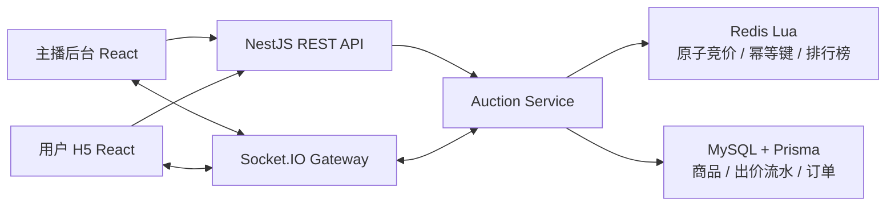

# 抖音电商直播竞拍全栈系统

面向直播电商场景的实时竞拍系统。主播可以创建商品、配置竞拍规则并开拍；多个用户可以进入同一直播间实时出价；系统负责校验价格、广播状态、封顶成交、生成唯一订单并完成模拟支付。

当前版本已完成 P0 闭环和 P1 核心优化，适合本地演示、自动化验证和性能对比。

## 已实现功能

### 主播端

- 创建商品、直播间和竞拍。
- 按创建时间倒序分页查看竞拍记录，每页 `10` 条，并在多场并行竞拍之间切换控制。
- 点击竞拍记录查看逐次出价流水、竞拍者、成交订单和支付状态。
- 配置起拍价、固定加价、封顶价和竞拍时长。
- 复制竞拍 ID、开始竞拍、异常取消。
- 查看当前价、领先者、倒计时、参与人数、排行榜和现场动态。

### 用户端

- 创建演示用户并通过竞拍 ID 加入直播间。
- 查看商品、当前价、最低可出价、封顶价、倒计时和实时排行榜。
- 接收新出价、被超越、自动延时、成交和取消提示。
- 断线重连后恢复最新状态。
- 竞拍获胜后查看订单并完成模拟支付。

### 服务端

- NestJS REST API 和 Socket.IO 房间广播。
- Redis Lua 原子竞价：幂等校验、最低价校验、封顶成交、自动延时和版本更新。
- 倒计时结束自动结算：有领先者成交，无人出价流拍。
- 当前领先者不能连续给自己加价。
- Redis ZSET 实时排行榜。
- MySQL 持久化商品、竞拍、出价和订单。
- `requestId` 幂等键和订单唯一约束。

## 技术栈

| 层级 | 技术 |
|---|---|
| 主播后台 | React、TypeScript、Vite |
| 用户 H5 | React、TypeScript、Vite |
| 服务端 | Node.js、NestJS |
| 实时通信 | Socket.IO |
| 热点状态 | Redis、Lua、ZSET |
| 持久化 | MySQL、Prisma |
| 本地环境 | Docker Compose |
| 自动测试 | Jest、Node.js Smoke、Chrome DevTools Protocol E2E |

## 架构



架构图 PNG：[docs/system-architecture.png](docs/system-architecture.png)。

详细说明见 [docs/architecture.md](docs/architecture.md)。

## 目录结构

```text
apps/
  admin-web/        主播后台
  user-web/         用户端 H5
  api-server/       NestJS API、Socket.IO、Prisma
packages/
  shared-types/     跨端协议类型
infra/
  docker-compose.yml
scripts/
  smoke-auction-flow.cjs
  e2e-browser-flow.cjs
  perf-baseline.cjs
docs/
  demo-script.md
  architecture.md
  acceptance-checklist.md
```

## 环境依赖

- Node.js `20+`
- pnpm `10+`
- Docker Desktop
- Git
- Google Chrome：仅 `pnpm e2e` 需要

检查环境：

```bash
pnpm env:check
```

## 本地初始化

```bash
pnpm install
pnpm env:setup
docker compose -f infra/docker-compose.yml up -d
pnpm db:generate
pnpm db:migrate
```

## 启动开发服务

```bash
pnpm dev
```

访问：

- 主播端：[http://localhost:5173](http://localhost:5173)
- 用户端：[http://localhost:5174](http://localhost:5174)
- API 健康检查：[http://localhost:3000/api/health](http://localhost:3000/api/health)

## 测试命令

```bash
# 规则测试
pnpm --filter api-server test

# 完整 API、Socket.IO、订单和异常链路
pnpm smoke

# 真实浏览器页面闭环：自动启动本机 Chrome 无头模式
pnpm e2e

# 单实例压测基线
pnpm perf:baseline
```

## 性能结果

Redis Lua 优化后，本机单实例结果：

| 场景 | 吞吐 | P95 | 结果 |
|---|---:|---:|---|
| 单场热点竞拍 | `1435.97 req/s` | `12.08 ms` | 一致性通过 |
| 十场并行竞拍 | `533.85 req/s` | `23.49 ms` | `100/100` 请求成功 |
| 重复与非法请求 | `2286.68 req/s` | `40.53 ms` | 全部正确处理 |
| 封顶成交竞争 | `1850.50 req/s` | `9.67 ms` | 仅一个订单 |

对比报告见 [docs/phase-11-p1-f-redis-lua-report.md](docs/phase-11-p1-f-redis-lua-report.md)。

## 演示

正式演示步骤见 [docs/demo-script.md](docs/demo-script.md)。建议打开一个主播端页面和两个用户端页面。

## 安全约束

- 禁止提交 `.env`。
- 禁止将 API Key、Token、密码、真实账号或私有接口信息上传到 GitHub 等公共平台。
- 仓库只保留 `.env.example` 无效示例配置。
- 当前运行时不调用任何外部 AI API。
- 模拟支付不连接真实支付平台。

## 当前边界

- 当前使用固定直播画面占位，不包含真实直播推流。
- 当前支付为模拟支付。
- 当前支持封顶价立即成交和倒计时结束自动结算。
- 当前验证为单 API 实例；Socket.IO Redis Adapter 和多实例部署尚未实现。
- AI 智能估值和出价建议已纳入规划，但尚未实现。

## 文档入口

- [本地 Demo 使用说明](docs/local-demo-guide.md)
- [系统架构图 PNG](docs/system-architecture.png)
- [正式演示脚本](docs/demo-script.md)
- [系统架构说明](docs/architecture.md)
- [验收清单](docs/acceptance-checklist.md)
- [项目计划](项目计划.md)
- [P1-F 性能报告](docs/phase-11-p1-f-redis-lua-report.md)
