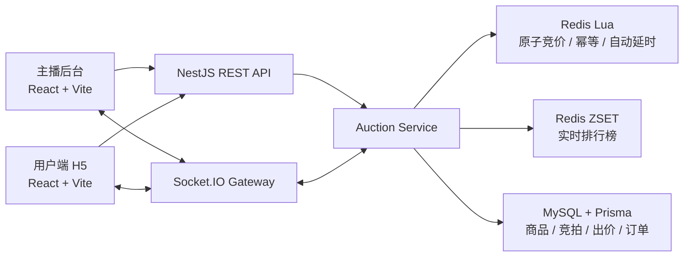
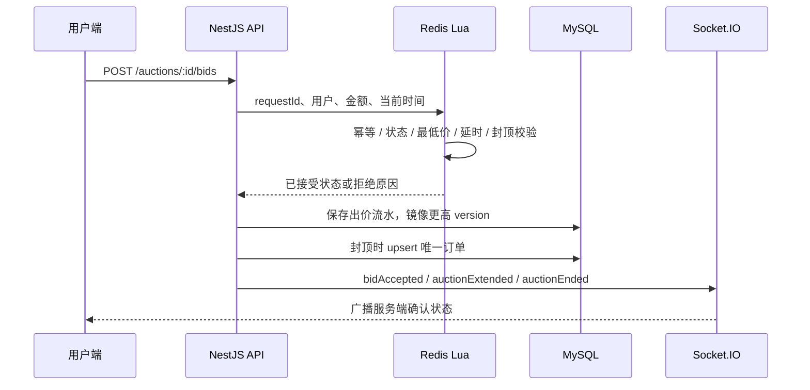

# 系统架构说明

## 1. 架构目标

系统需要同时满足：

1. 主播端和多个用户端实时同步。
2. 同一场竞拍的出价严格有序。
3. 非法低价、重复请求和成交后出价必须被拒绝。
4. 封顶成交时最多生成一个订单。
5. 高频状态处理与持久化存储职责分离。
6. 倒计时结束时自动成交或流拍。

## 2. 总体架构

## 3. 核心模块

| 模块 | 职责 |
|---|---|
| `admin-web` | 主播创建竞拍、开拍、异常取消和实时控场 |
| `user-web` | 用户加入直播间、出价、查看榜单和模拟支付 |
| `api-server` | REST API、DTO 校验和领域流程编排 |
| `AuctionsGateway` | Socket.IO 房间加入、快照恢复和实时事件 |
| `RedisAuctionService` | Redis Lua 原子竞价和 ZSET 排行榜 |
| Prisma + MySQL | 业务数据持久化和唯一订单兜底 |

## 4. 竞价链路

## 5. 一致性策略

### Redis

- Redis 是运行中竞拍热点状态的可信来源。
- Lua 脚本一次完成判断和更新，保证同一场竞拍严格有序。
- `requestId` 幂等键使用 TTL，避免重复提交。
- ZSET 保存用户最高出价，支持实时排行榜。

### MySQL

- 保存商品、直播间、竞拍、出价流水和订单。
- 竞拍镜像只接受更高 `version`，避免并发落库顺序反转。
- `bids.requestId UNIQUE` 防止重复流水。
- `orders.auctionId UNIQUE` 防止重复订单。

### 客户端

- 客户端不自行判断成交。
- 所有页面消费服务端快照和实时广播。
- Socket.IO 重连后重新发送 `joinAuction`，使用 `auctionSnapshot` 恢复状态。

## 6. 实时事件

| 事件 | 用途 |
|---|---|
| `auctionSnapshot` | 加入房间或重连后恢复 |
| `auctionStarted` | 竞拍开始 |
| `bidAccepted` | 合法出价被接受 |
| `auctionExtended` | 最后时刻自动延时 |
| `auctionCancelled` | 主播异常取消 |
| `auctionEnded` | 封顶成交或倒计时结算 |

## 7. API 概览

| 方法 | 路径 | 用途 |
|---|---|---|
| `GET` | `/api/health` | 健康检查 |
| `POST` | `/api/products` | 创建商品 |
| `POST` | `/api/live-rooms` | 创建直播间 |
| `POST` | `/api/users` | 创建演示用户 |
| `POST` | `/api/auctions` | 创建竞拍 |
| `GET` | `/api/auctions/:id` | 查询竞拍详情 |
| `GET` | `/api/auctions?page=1&pageSize=10` | 按创建时间倒序分页查询竞拍记录 |
| `POST` | `/api/auctions/:id/start` | 开始竞拍 |
| `POST` | `/api/auctions/:id/cancel` | 异常取消 |
| `POST` | `/api/auctions/:id/bids` | 提交出价 |
| `GET` | `/api/auctions/:id/leaderboard` | 查询排行榜 |
| `GET` | `/api/orders/:id` | 查询订单 |
| `POST` | `/api/orders/:id/pay` | 模拟支付 |

## 8. 性能优化结果

Redis Lua 优化后：

- 单场热点吞吐从 `984.01 req/s` 提升至 `1435.97 req/s`。
- 单场热点 P95 从 `27.44 ms` 降至 `12.08 ms`。
- 单场热点 `409` 冲突从 `142` 降至 `0`。
- 十场并行竞拍由 `92/100` 成功提升为 `100/100`。

## 9. 已知边界

- 当前为单 API 实例，尚未接入 Socket.IO Redis Adapter。
- 当前使用请求内同步落库，不使用消息队列。
- 倒计时调度器每 `500ms` 检查到期竞拍：有领先者则成交并生成订单，无人出价则流拍。
- 直播推流、真实支付和登录鉴权未接入。
- AI 智能估值和出价建议已规划，但尚未实现。
