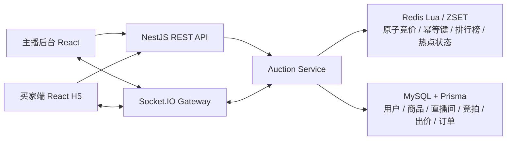

# 「实时竞拍大师」项目最终提交材料

## 1. 课题名称

「实时竞拍大师」—— 抖音电商直播竞拍全栈系统设计与实现

## 2. 团队名称与成员名单

| 团队名称 | 成员 | 学校 | 专业 | 组队形式 | 角色 |
|---|---|---|---|---|---|
| 杨子研—北京邮电大学—个人组队 | 杨子研 | 北京邮电大学 | 待补充 | 个人组队 | 项目设计、前后端实现、数据层、测试验证、文档与演示材料整理 |

## 3. 分工说明

本项目为个人组队，不涉及多人协作分工。整体工作由杨子研完成，覆盖：

- 产品与业务流程设计：直播竞拍业务链路、主播端/买家端交互、竞拍状态流转。
- 前端实现：主播后台、买家 H5、竞拍列表、详情页、实时排行榜、订单展示。
- 后端实现：NestJS API、Socket.IO 实时广播、竞拍状态机、订单服务、角色鉴权。
- 数据与缓存：MySQL 持久化、Redis 热点状态、Redis Lua 原子竞价、ZSET 排行榜。
- 测试与验证：基础测试、测试 2.0 专项用例、并发压测、故障恢复、一致性验证。
- 文档与演示：README、架构说明、测试用例、执行记录、中期说明、演示视频。

## 4. 核心功能清单

1. 主播端竞拍管理：主播登录后可创建商品、直播间和竞拍，配置起拍价、加价幅度、封顶价、竞拍时长、自动延时规则，并可开始或取消竞拍。
2. 多场竞拍与后台追踪：主播端支持分页查看竞拍记录，每页 10 条；可点击任意竞拍查看详情、出价流水、成交订单、支付状态和历史记录。
3. 买家端实时竞价：买家可创建演示用户，通过竞拍 ID 加入直播间，查看当前价、最低可出价、封顶价、倒计时、排行榜，并实时提交出价。
4. 实时同步与状态广播：通过 Socket.IO 按竞拍房间广播竞拍快照、新出价、被超越、自动延时、成交和取消事件。
5. 竞价规则与一致性控制：服务端校验非法低价、同一领先者连续出价、重复请求、成交后出价、取消后出价；Redis Lua 保证高频竞价原子处理。
6. 成交与订单闭环：达到封顶价自动成交，倒计时结束自动结算；系统生成唯一订单，赢家可完成模拟支付，主播端可追踪订单状态。

## 5. 端到端使用流程

1. 主播进入主播后台，登录主播身份。
2. 主播创建拍品和直播间，配置起拍价、加价幅度、封顶价、竞拍时长和自动延时规则。
3. 主播在竞拍列表中查看已创建场次，选择目标拍品并点击开始竞拍。
4. 买家在用户端创建演示用户，通过竞拍 ID 加入对应直播间。
5. 多名买家在同一直播间内依次或并发出价，系统实时更新当前价、领先者、排行榜和参与人数。
6. 服务端对每次出价进行规则校验，非法低价、重复请求、连续自我加价、成交后出价和取消后出价都会被拒绝。
7. 达到封顶价或倒计时结束后，系统自动成交或流拍；成交时生成唯一订单。
8. 赢家在买家端完成模拟支付，主播端可在详情页查看出价流水、订单、支付状态和最终结果。

## 6. 在线 Demo 链接

当前版本暂未部署公网在线交互 Demo，采用“本地 Demo + 演示视频”方式替代。

本地 Demo 使用说明公开文档：

```text
https://my.feishu.cn/docx/BAfJdZ8odoVn9FxPPw5c0pnon2e?from=from_copylink
```

本地 Demo 访问方式：

- 主播端：`http://localhost:5173`
- 买家端：`http://localhost:5174`
- API 健康检查：`http://localhost:3000/api/health`

本地运行依赖：

- Docker Desktop
- Node.js 20+
- pnpm 10+
- MySQL / Redis 由 `infra/docker-compose.yml` 启动

启动方式：

```bash
cd "抖音电商 ai 课题"
docker compose -f infra/docker-compose.yml up -d
pnpm dev
```

说明：

- 当前暂未部署公网可交互 Demo。
- 第 6 项“在线 Demo 链接”使用上述飞书公开文档作为替代入口。
- 文档内说明本地启动方式、访问地址、演示视频链接和源码仓库链接。

## 7. 演示视频链接

飞书公开视频链接：

```text
https://my.feishu.cn/file/IGuHbFBDjoK9aNxD1IPcdWj9nah?from=from_copylink
```

演示视频本地文件：

```text
/Users/yzy/Desktop/抖音电商直播竞拍系统完整演示.mov
```

视频内容覆盖：

- 主播端登录、竞拍规则配置、多场竞拍记录。
- 主播端竞拍详情、出价流水、订单状态。
- 多买家加入同一竞拍场次并实时出价。
- 多场竞拍与直播间隔离。
- 连续出价拒绝、非法低价拒绝、取消后不可出价、自动延时、封顶成交、成交后拒绝出价。
- 最后简要说明测试 2.0 专项验证结果。

提交前建议使用无痕窗口打开该链接，确认未登录飞书时也可以访问和播放。

## 8. 源代码仓库链接

主仓库链接：

```text
https://github.com/YYYangSir/RTB-Master
```

分支说明：

```text
main：最终提交主分支，包含前端、后端、基础设施配置、测试脚本、测试报告和项目文档。
```

最后提交记录：

```text
https://github.com/YYYangSir/RTB-Master/commits/main
```

仓库状态：

- GitHub 仓库已公开发布。
- 本地 `main` 与远程 `origin/main` 已同步。
- 上传前已排除 `.env`、简历、视频、`node_modules` 和构建产物，并检查明显 API Key / Token。

## 9. README / 运行说明

已准备好。

项目根目录已有 `README.md`，内容包括：

- 项目简介。
- 已实现功能。
- 技术栈。
- 系统架构。
- 目录结构。
- 环境依赖。
- 本地初始化命令。
- 启动方式。
- 测试命令。
- 性能结果。
- 演示说明。
- 安全约束和当前边界。

运行核心命令：

```bash
pnpm install
pnpm env:setup
docker compose -f infra/docker-compose.yml up -d
pnpm db:generate
pnpm db:migrate
pnpm dev
```

## 10. 系统架构图

当前系统架构如下：



架构说明：

- 前端分为主播后台和买家端 H5。
- 后端使用 NestJS 提供 REST API 和 Socket.IO Gateway。
- Redis 负责竞拍运行时热点状态、幂等键、排行榜和 Lua 原子竞价。
- MySQL 负责持久化用户、商品、直播间、竞拍、出价和订单。
- WebSocket 按竞拍房间进行广播，保证不同直播间互不串场。

当前缺少内容：

- 若最终提交平台不支持 Mermaid，建议将该架构图导出为图片后提交。

## 11. 大模型 / AI 能力使用说明

当前系统运行时不调用外部大模型 API，不依赖 AI API Key，也不会把业务数据上传给模型服务。

AI 使用方式主要体现在研发辅助阶段：

- 用于需求拆解和阶段规划。
- 用于全栈系统设计路线梳理。
- 用于辅助生成部分代码、测试脚本、文档结构和演示材料。
- 用于根据测试结果总结问题、修复方向和提交材料。

当前系统内未实现的 AI 运行时能力：

- 未接入商品估值模型。
- 未接入买家出价建议模型。
- 未实现 Agent / RAG / 向量库流程。
- 未在实时竞价链路中调用大模型。

说明：

本项目当前重点是实时竞拍系统工程闭环、高并发处理和一致性验证。为了避免外部模型延迟、成本和稳定性影响竞价关键链路，当前没有把 AI API 放入运行时竞拍流程。

## 12. 关键工程难点与解决方案

### 难点一：高并发出价下的竞价顺序与状态一致性

问题：

- 多个买家可能同时出价。
- 若直接写 MySQL 或仅靠普通接口逻辑，容易出现价格覆盖、重复成交、低价成功、出价丢失等问题。

解决方案：

- 使用 Redis Lua 在服务端原子处理同一场竞拍的出价。
- 在 Lua 中统一完成状态检查、价格校验、幂等判断、排行榜更新、封顶成交和版本推进。
- 使用 MySQL 持久化出价流水和订单，保证历史可追溯。

### 难点二：WebSocket 实时同步与多直播间隔离

问题：

- 直播竞拍需要所有参与者实时看到价格、领先者、排行榜和成交状态。
- 多场竞拍同时运行时，不能出现跨房间广播、状态串场。

解决方案：

- 使用 Socket.IO 房间机制，按 `auctionId` 加入对应竞拍房间。
- 每次竞价成功后只向当前竞拍房间广播。
- 测试 2.0 中已验证多直播间混合流量隔离，跨房间消息数为 0。

### 难点三：成交、取消、延时和故障恢复下的数据一致性

问题：

- 封顶成交只能生成一个订单。
- 取消后不能继续出价，也不能生成订单。
- 自动延时后的 `endAt` 需要在 Redis、MySQL、HTTP、WebSocket 和刷新快照中一致。
- MySQL / Redis / 订单生成异常时，不能出现虚假成交或前后端状态分裂。

解决方案：

- `orders.auctionId` 使用唯一约束，确保一场竞拍最多一个订单。
- 取消、成交、自动延时均作为明确状态流转处理。
- 增加故障恢复测试和一致性专项测试，验证 MySQL / Redis / HTTP / WebSocket / 前端刷新快照最终一致。

## 13. 项目亮点 / 创新点

1. 从页面 Demo 扩展为完整实时竞拍工程闭环：包含主播端、买家端、服务端、Redis、MySQL、WebSocket、订单和测试材料。
2. 针对直播竞拍核心风险做了工程化处理：并发出价、重复请求、非法低价、自动延时、封顶成交、取消竞拍和多直播间隔离。
3. 测试验证较完整：除基础 smoke / E2E 外，还完成测试 2.0 专项验证，覆盖 100 用户混合流量、1000 WebSocket、故障恢复、资源回收和数据一致性。

## 14. 其余材料

### 14.a 性能指标 / 压测结果

已准备好。

README 中已有本机单实例压测结果：

| 场景 | 吞吐 | P95 | 结果 |
|---|---:|---:|---|
| 单场热点竞拍 | `1435.97 req/s` | `12.08 ms` | 一致性通过 |
| 十场并行竞拍 | `533.85 req/s` | `23.49 ms` | `100/100` 请求成功 |
| 重复与非法请求 | `2286.68 req/s` | `40.53 ms` | 全部正确处理 |
| 封顶成交竞争 | `1850.50 req/s` | `9.67 ms` | 仅一个订单 |

测试 2.0 已完成：

- 100 用户真实混合竞拍流量。
- 1000 WebSocket 在线 10 分钟保持。
- 1000 WebSocket 广播延迟。
- 1000 在线下真实出价广播。
- 多直播间混合流量隔离。
- 稳定性测试后的资源回收检查。

### 14.b Prompt 策略 / Agent 流程图

当前系统运行时未实现 Agent / RAG / Prompt 模块，因此没有系统内 Prompt 策略或 Agent 流程图。

可以提交的说明：

- AI 主要用于研发辅助，不进入生产竞价链路。
- 当前没有运行时模型调用成本、召回率或大模型成功率指标。
- 若后续扩展 AI 出价建议，可再补充 Prompt 模板、模型调用流程、失败兜底和人工评估方法。

当前缺少内容：

- 系统内 AI Agent 流程图。
- 运行时 Prompt 模板。
- RAG / 向量库方案。

### 14.c 评测方案与样例结果

系统工程评测已准备好，AI 模型评测暂不适用。

系统评测材料包括：

- `直播竞猜测试用例.md`
- `直播竞猜测试执行记录.md`
- `直播竞拍测试用例2.0.md`
- `reports/2.0-TC-*.json`
- `scripts/run-2.0-*.cjs`

测试 2.0 推荐顺序中的 18 个用例已全部执行并通过，覆盖：

- 稳定性测试。
- 混合竞拍流量。
- Redis / MySQL / 前端一致性。
- 最后一分钟集中抢价。
- 自动延时一致性。
- 1000 WebSocket 在线保持。
- 广播延迟。
- Redis / MySQL / WebSocket / 订单生成失败故障恢复。
- 多直播间隔离。
- 封顶成交一致性。
- 取消竞拍一致性。

当前缺少内容：

- 大模型输出样例。
- AI 推荐结果人工评估表。
- AI 模型自动评估指标。

### 14.d 用户反馈 / 内测记录

当前暂未形成正式用户反馈或内测记录。

当前缺少内容：

- 老师/同学/用户试用反馈。
- 反馈问题清单。
- 根据反馈进行二次优化的记录。

建议后续补充：

| 反馈对象 | 试用内容 | 反馈结论 | 是否修复 |
|---|---|---|---|
| 待填写 | 主播端创建竞拍、买家端出价、成交订单 | 待填写 | 待填写 |

## 当前最终提交状态总览

| 序号 | 内容 | 状态 |
|---:|---|---|
| 1 | 课题名称 | 已完成 |
| 2 | 团队名称与成员名单 | 基本完成，专业信息待补充 |
| 3 | 分工说明 | 已完成 |
| 4 | 核心功能清单 | 已完成 |
| 5 | 端到端使用流程 | 已完成 |
| 6 | 在线 Demo 链接 | 已完成，使用本地 Demo 说明飞书公开文档作为替代入口 |
| 7 | 演示视频链接 | 已完成，飞书公开链接已补充 |
| 8 | 源代码仓库链接 | 已完成，已提供公开主仓库、main 分支说明和最后提交记录 |
| 9 | README / 运行说明 | 已完成 |
| 10 | 系统架构图 | 已完成 Mermaid 版；如需图片需导出 |
| 11 | 大模型 / AI 能力使用说明 | 已完成，如实说明当前运行时未调用 AI API |
| 12 | 关键工程难点与解决方案 | 已完成 |
| 13 | 项目亮点 / 创新点 | 已完成 |
| 14.a | 性能指标 / 压测结果 | 已完成 |
| 14.b | Prompt 策略 / Agent 流程图 | 当前系统不适用，后续 AI 扩展时补充 |
| 14.c | 评测方案与样例结果 | 系统评测已完成；AI 评测不适用 |
| 14.d | 用户反馈 / 内测记录 | 暂缺，需真实试用反馈 |
