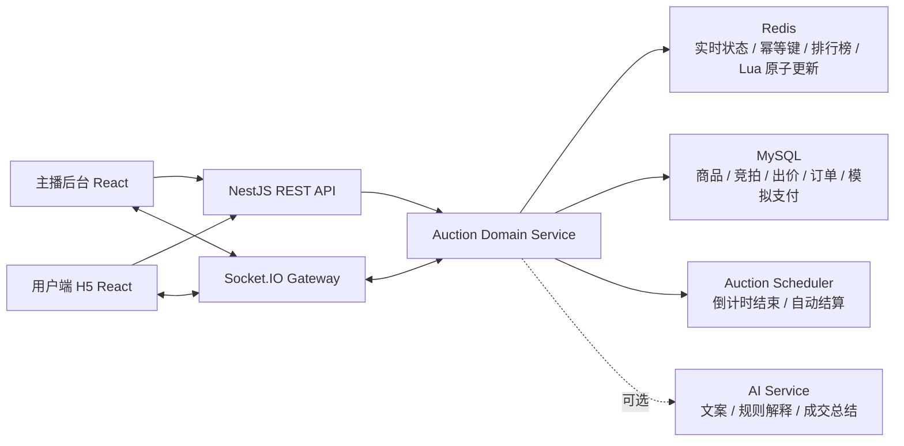
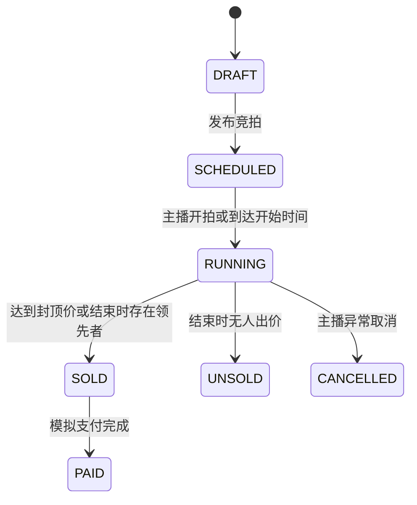

# 抖音电商 AI 课题：直播竞拍全栈系统项目计划

> 文档用途：本文件是项目实现、联调、验证和验收材料整理的主要执行基线。  
> 当前目标：优先在一天内完成可运行、可演示、可验证的 MVP 初步闭环。  
> 安全约束：禁止将 API Key、Token、密码、真实账号、`.env` 文件上传到 GitHub、GitLab 或其他公共平台。

## 1. 课题背景

课题名称：「实时竞拍大师」—— 抖音电商直播竞拍全栈系统设计与实现。

直播电商中的珠宝、艺术品、二手奢侈品等高价值商品难以统一定价。竞拍模式可以通过直播间实时互动和竞争性出价，让商品价格由市场动态形成。

本项目需要实现完整业务闭环：

```text
商品上架
→ 配置竞拍规则
→ 主播开始竞拍
→ 用户进入直播间
→ 多用户实时出价
→ 动态更新当前价格和领先者
→ 自动延时、封顶成交或倒计时结束
→ 自动生成唯一订单
→ 模拟支付
→ 查看成交结果和历史记录
```

课题的技术重点不是 AI 模型调用，而是实时系统工程能力：

- WebSocket 长连接和房间级广播。
- 高并发出价下的数据一致性。
- 状态机和复杂竞拍规则。
- Redis 原子更新、幂等控制和热点状态管理。
- MySQL 持久化和唯一订单约束。
- 前后端完整交付、部署和验证。

### 1.1 AI 能力定位

MVP 不调用任何大模型 API。AI 功能不是核心链路的必要条件。

可选 AI 功能只能作为 `P2` 加分项，并且必须可降级：

- 根据商品信息生成直播介绍文案。
- 生成竞拍规则的用户友好解释。
- 竞拍结束后生成成交总结。

任何 AI 服务故障都不得影响开拍、出价、延时、成交和订单生成。

## 2. 项目目标和范围

### 2.1 一天内必须完成的 MVP

今天只完成可演示的初步闭环：

```text
主播创建商品和竞拍
→ 配置起拍价、固定加价、时长、封顶价
→ 主播开始竞拍
→ 两个用户同时进入同一直播间
→ 用户出价
→ 所有页面实时更新当前价格和领先者
→ 达到封顶价或倒计时结束
→ 系统只生成一个订单
→ 赢家查看成交结果
→ 进入模拟支付页并完成模拟支付
```

### 2.2 MVP 暂不实现

- 真实直播推流：使用固定视频、占位图或模拟直播区域。
- 真实支付：只更新模拟支付状态。
- 复杂权限系统：使用简单演示账号或本地用户选择器。
- AI API 调用。
- 单点登录、短信验证码、第三方账号登录。
- 多机部署和复杂运维平台。
- 1000+ 用户性能优化：先保留扩展设计，完成后再压测优化。

### 2.3 后续增强范围

- 商品图片上传和对象存储。
- 完整历史竞拍记录。
- 主播异常取消竞拍。
- 自动延时的完整交互提示。
- 实时排行榜和被超越提醒。
- 动画、音效、移动端体验优化。
- Socket.IO Redis Adapter、多实例部署、限流和监控。
- 可选 AI 加分功能。

### 2.4 亮点增强路线

在完成 P1 演示体验后，边实施边优化以下亮点。所有增强功能必须遵循一个原则：不能影响实时出价、结算和订单生成的稳定性。

#### 亮点一：智能竞拍助手

商家端提供：

- 推荐起拍价、固定加价幅度和竞拍时长。
- 根据参与人数、出价频率、剩余时间和价格变化判断竞拍热度。
- 给出是否建议延时、预计成交价格区间和成交复盘建议。

买家端提供：

- 结合商品参考价值、当前价格和场内竞价趋势，展示预计成交价区间。
- 每轮出价前给出两档建议：保守建议和进取建议。
- 展示简短、可解释的建议理由，避免黑盒输出。

第一版不依赖外部 AI API，使用规则和统计指标实现可解释建议。后续如有时间，可选接入大模型 API，仅用于生成商品卖点文案、解释建议和成交复盘报告。任何 API Key 只能通过环境变量配置，禁止上传到 GitHub 等公共平台。

#### 亮点二：可靠的高并发竞价

目标：

- 支持多个商品或多个直播间同时进行竞拍。
- 支持同一件商品有大量用户同时出价。
- 保证不同竞拍可以并行，同一场竞拍的状态更新严格有序。

实现方向：

- Redis 保存热点竞拍状态、幂等键和排行榜。
- Redis Lua 脚本原子完成幂等校验、状态校验、最低价校验、价格更新和版本递增。
- MySQL 保存竞拍流水、最终状态和订单，使用唯一约束避免重复订单。
- Socket.IO 只广播服务端确认接受的结果。
- 使用 `requestId`、`version` 和 `seq` 解决重复请求、并发覆盖和客户端状态恢复问题。

必须验证：

- 非法低价被拒绝。
- 重复请求只处理一次。
- 高并发出价不会覆盖正确结果，也不会吞掉已接受的出价。
- 成交后不能继续出价。
- 多个竞拍同时运行时互不影响。
- 压测结束后 Redis、MySQL 和客户端最终状态一致。

#### 可选体验亮点

按优先级逐步增加：

1. 最后时刻自动延时，避免卡点抢拍。
2. 价格走势、参与人数、出价次数和竞拍热度可视化。
3. 商家成交复盘报告。
4. 异常高频出价、重复请求和异常用户风控标记。
5. 断线重连后自动恢复最新竞拍状态。

#### 增强实施顺序

1. 完成 P1 页面和完整演示体验。
2. 增加自动延时、排行榜、提醒和异常取消。
3. 实现不依赖外部 API 的基础智能建议。
4. 使用 Redis Lua 实现高并发原子竞价。
5. 增加并发压测脚本和测试报告。
6. 增加可视化与成交复盘页面。
7. 时间充足时，再接入可选的大模型 API 生成解释文案。

## 3. 总体技术架构

### 3.1 推荐技术栈

| 层级 | 技术选型 | 说明 |
|---|---|---|
| Monorepo | pnpm workspace | 管理多个应用和共享类型 |
| 主播后台 | React + TypeScript + Vite + Ant Design | 快速实现 PC 管理页面 |
| 用户端 H5 | React + TypeScript + Vite | 快速实现移动端竞拍页面 |
| 前端状态 | Zustand | 轻量管理用户、竞拍快照和连接状态 |
| 后端 | Node.js + NestJS | 快速实现 REST API、WebSocket 和模块化服务 |
| 实时通信 | Socket.IO | 房间广播、自动重连、事件协议 |
| 核心数据库 | MySQL | 存储商品、竞拍、出价、订单、支付记录 |
| 高频状态 | Redis | 当前价、领先者、幂等键、排行榜、房间状态 |
| ORM | Prisma | 数据模型清晰，迁移和类型生成方便 |
| 本地环境 | Docker Compose | 启动 MySQL 和 Redis |
| 单元测试 | Vitest 或 Jest | 验证竞拍规则和领域服务 |
| 端到端测试 | Playwright | 验证主播和两个用户的完整流程 |
| 压测 | k6 | 验证并发出价和接口延迟 |
| 部署 | Docker + Nginx | 后续发布在线 Demo |

### 3.2 架构图



### 3.3 关键架构原则

1. 服务端是竞拍状态的唯一可信来源。前端只展示状态，不自行判定成交。
2. 金额全部使用整数分存储，禁止使用浮点数计算价格。
3. 每次出价携带唯一 `requestId`，避免重复提交。
4. 每次广播携带递增 `seq`、`version` 和 `serverTime`。
5. 客户端倒计时基于服务端时间校准，不依赖本地持续累减。
6. 热路径优先使用 Redis Lua 原子更新，不对每次出价使用重量级分布式锁。
7. 最终订单由数据库唯一约束兜底，确保每场竞拍最多生成一个订单。
8. AI 功能禁止进入实时出价关键路径。

## 4. 功能模块拆解

### 4.1 模块优先级定义

| 优先级 | 定义 | 处理原则 |
|---|---|---|
| P0 | 初步闭环必须完成 | 今天优先完成，不允许被非关键功能阻塞 |
| P1 | 完整验收需要 | P0 稳定后实现 |
| P2 | 加分项 | 时间充足时实现，不影响主链路 |

### 4.2 功能清单

| 模块 | 功能 | 优先级 | MVP 是否实现 |
|---|---|---:|---|
| 工程基础 | Monorepo、环境变量、Docker Compose、数据库迁移 | P0 | 是 |
| 商品管理 | 创建商品、名称、介绍、图片 URL | P0 | 是 |
| 竞拍配置 | 起拍价、固定加价、时长、封顶价 | P0 | 是 |
| 竞拍控制 | 开拍、查看状态 | P0 | 是 |
| 用户直播间 | 商品信息、当前价、领先者、倒计时 | P0 | 是 |
| 实时出价 | 提交出价、校验、广播、错误提示 | P0 | 是 |
| 竞拍结算 | 封顶成交、倒计时结束、唯一订单 | P0 | 是 |
| 模拟支付 | 查询订单、更新模拟支付状态 | P0 | 是 |
| 自动延时 | 结束前出价延长 10-30 秒 | P1 | 建议今天完成 |
| 主播取消 | 取消异常竞拍，客户端收到通知 | P1 | 后续完成 |
| 排行榜 | 查看用户排名、出价差距 | P1 | 后续完成 |
| 提醒反馈 | 被超越、延时、结束提示 | P1 | 后续完成 |
| 历史记录 | 用户参与记录、主播成交记录 | P1 | 后续完成 |
| 性能优化 | Redis Lua、批量落库、限流、多实例 | P1/P2 | 分阶段完成 |
| 体验增强 | 动画、音效、直播画面优化 | P2 | 后续完成 |
| 智能建议 | 起拍价、预计成交价、保守和进取出价建议 | P2 | 先用规则和统计实现 |
| AI 能力 | 商品文案、建议解释、成交总结 | P2 | 外部 API 可选，不进入核心链路 |

## 5. 领域模型设计

### 5.1 状态机



状态变更约束：

- `DRAFT` 和 `SCHEDULED` 可修改规则。
- `RUNNING` 不允许修改起拍价、固定加价和封顶价。
- `RUNNING` 可接收合法出价。
- `SOLD`、`UNSOLD`、`CANCELLED` 均不可继续出价。
- `SOLD` 只允许生成一个订单。

### 5.2 核心数据表

#### `users`

| 字段 | 说明 |
|---|---|
| `id` | 用户 ID |
| `nickname` | 展示昵称 |
| `role` | `ADMIN` 或 `BIDDER` |

#### `products`

| 字段 | 说明 |
|---|---|
| `id` | 商品 ID |
| `name` | 商品名称 |
| `description` | 商品介绍 |
| `image_url` | 图片地址 |

#### `live_rooms`

| 字段 | 说明 |
|---|---|
| `id` | 直播间 ID |
| `title` | 直播间名称 |
| `status` | 直播间状态 |

#### `auctions`

| 字段 | 说明 |
|---|---|
| `id` | 竞拍 ID |
| `product_id` | 商品 ID |
| `live_room_id` | 直播间 ID |
| `status` | 状态机当前状态 |
| `start_price_cent` | 起拍价，单位分 |
| `increment_cent` | 固定加价幅度，单位分 |
| `cap_price_cent` | 封顶价，单位分 |
| `current_price_cent` | 当前价格，单位分 |
| `leader_user_id` | 当前领先用户 |
| `start_at` | 开始时间 |
| `end_at` | 结束时间 |
| `extension_window_sec` | 延时触发窗口 |
| `extension_sec` | 每次延长秒数 |
| `version` | 乐观锁版本 |

#### `bids`

| 字段 | 说明 |
|---|---|
| `id` | 出价流水 ID |
| `auction_id` | 竞拍 ID |
| `user_id` | 用户 ID |
| `request_id` | 幂等 ID，唯一索引 |
| `amount_cent` | 出价金额 |
| `created_at` | 出价时间 |

#### `orders`

| 字段 | 说明 |
|---|---|
| `id` | 订单 ID |
| `auction_id` | 竞拍 ID，唯一索引 |
| `winner_user_id` | 赢家用户 ID |
| `amount_cent` | 成交价 |
| `status` | `PENDING_PAYMENT`、`PAID` |

### 5.3 Redis Key 设计

```text
auction:{auctionId}:state              # 当前价、领先者、结束时间、状态、版本号、seq
auction:{auctionId}:request:{requestId} # 幂等键，设置 TTL
auction:{auctionId}:ranking            # ZSET 排行榜
room:{liveRoomId}:online               # 在线用户统计
```

## 6. 接口和实时事件

### 6.1 REST API

| 方法 | 路径 | 作用 | 优先级 |
|---|---|---|---:|
| `POST` | `/api/products` | 创建商品 | P0 |
| `GET` | `/api/products` | 商品列表 | P0 |
| `POST` | `/api/auctions` | 创建竞拍和规则 | P0 |
| `GET` | `/api/auctions/:id` | 获取竞拍快照 | P0 |
| `POST` | `/api/auctions/:id/start` | 主播开拍 | P0 |
| `POST` | `/api/auctions/:id/bids` | 用户出价 | P0 |
| `GET` | `/api/orders/:id` | 查询订单 | P0 |
| `POST` | `/api/orders/:id/pay` | 模拟支付 | P0 |
| `POST` | `/api/auctions/:id/cancel` | 异常取消竞拍 | P1 |
| `GET` | `/api/users/:id/auction-history` | 用户历史记录 | P1 |

### 6.2 WebSocket 事件

| 事件 | 方向 | 作用 |
|---|---|---|
| `joinAuction` | 客户端 → 服务端 | 加入竞拍房间 |
| `leaveAuction` | 客户端 → 服务端 | 离开竞拍房间 |
| `auctionSnapshot` | 服务端 → 客户端 | 首次进入或重连后的完整快照 |
| `bidAccepted` | 服务端 → 客户端 | 出价成功 |
| `bidRejected` | 服务端 → 指定客户端 | 出价失败及原因 |
| `rankingChanged` | 服务端 → 房间 | 排行变化 |
| `auctionExtended` | 服务端 → 房间 | 自动延时 |
| `auctionEnded` | 服务端 → 房间 | 正常结束或封顶成交 |
| `auctionCancelled` | 服务端 → 房间 | 异常取消 |

标准广播结构：

```ts
interface AuctionEvent<T> {
  auctionId: string;
  seq: number;
  version: number;
  serverTime: number;
  payload: T;
}
```

## 7. 分阶段实现计划

## 阶段 0：冻结需求和边界

**优先级：P0**  
**预计时间：30 分钟**

### 任务

1. 确认 MVP 只实现一个直播间、一件正在竞拍的商品和两个以上竞拍用户。
2. 固化起拍价、固定加价、封顶价、倒计时和模拟支付规则。
3. 明确金额使用整数分。
4. 明确 MVP 不接入 AI API，不实现真实支付和真实直播推流。
5. 将后续新需求放入 `P1/P2`，不得中断 P0 实现。

### 完成标准

- 团队成员对 MVP 路径和非目标达成一致。
- 后续开发以本文件为基线。

---

## 阶段 1：初始化工程和基础设施

**优先级：P0**  
**预计时间：45-60 分钟**  
**前置依赖：阶段 0**

### 任务

1. 初始化 Monorepo：

```text
apps/
  admin-web/          # 主播后台
  user-web/           # 用户端 H5
  api-server/         # NestJS 服务
packages/
  shared-types/       # DTO、枚举、事件类型
infra/
  docker-compose.yml
```

2. 配置 `pnpm workspace`。
3. 使用 Docker Compose 启动 MySQL 和 Redis。
4. 创建 `.env.example`，仅保存占位符。
5. 将 `.env`、日志、构建产物加入 `.gitignore`。
6. 接入 Prisma，完成初始迁移。
7. 增加基础脚本：

```text
pnpm dev
pnpm test
pnpm build
pnpm lint
pnpm db:migrate
```

### 完成标准

- MySQL 和 Redis 可启动。
- 三个应用均可运行。
- 数据库迁移可执行。
- 仓库不包含真实密钥。

### 验证

```bash
docker compose up -d
pnpm install
pnpm db:migrate
pnpm dev
```

---

## 阶段 2：实现数据库模型和基础 API

**优先级：P0**  
**预计时间：60-90 分钟**  
**前置依赖：阶段 1**

### 任务

1. 建立 `users`、`products`、`live_rooms`、`auctions`、`bids`、`orders` 表。
2. 添加数据库唯一约束：

```text
bids.request_id UNIQUE
orders.auction_id UNIQUE
```

3. 实现商品创建和商品列表 API。
4. 实现竞拍创建、详情和开拍 API。
5. 增加基础参数校验：

- 起拍价不得小于 0。
- 固定加价必须大于 0。
- 封顶价必须大于起拍价。
- 竞拍时长必须大于 0。
- 运行中的竞拍不得修改关键规则。

### 完成标准

- 可通过 API 创建商品和竞拍。
- 可通过 API 开始竞拍。
- API 返回稳定的错误码和错误信息。

### 验证

- 使用 API 客户端或自动化测试创建一场竞拍。
- 验证非法价格和非法时长会被拒绝。

---

## 阶段 3：实现单实例竞拍领域服务

**优先级：P0**  
**预计时间：60-90 分钟**  
**前置依赖：阶段 2**

### 任务

1. 创建 `AuctionService.placeBid()`。
2. 以服务端时间判断是否允许出价。
3. 校验竞拍必须处于 `RUNNING`。
4. 校验价格满足：

```text
amountCent >= currentPriceCent + incrementCent
```

5. 写入 `bids` 流水。
6. 更新当前价格、领先者和 `version`。
7. 达到封顶价时立即将状态改为 `SOLD`。
8. 调用结算逻辑生成唯一订单。
9. 倒计时结束且存在领先者时结算为 `SOLD`。
10. 倒计时结束且无人出价时改为 `UNSOLD`。

### 必须编写的单元测试

| 测试场景 | 预期结果 |
|---|---|
| 首次合法出价 | 成功 |
| 低于最低可出价 | 拒绝 |
| 竞拍未开始 | 拒绝 |
| 竞拍已结束 | 拒绝 |
| 重复 `requestId` | 只处理一次 |
| 达到封顶价 | 立即成交 |
| 多次调用结算 | 只生成一个订单 |

### 完成标准

- 单实例下业务规则正确。
- 单元测试全部通过。

---

## 阶段 4：接入 WebSocket 实时同步

**优先级：P0**  
**预计时间：60 分钟**  
**前置依赖：阶段 3**

### 任务

1. 创建 Socket.IO Gateway。
2. 按 `auction:{auctionId}` 创建房间。
3. 用户进入房间时发送 `auctionSnapshot`。
4. 出价成功后广播 `bidAccepted`。
5. 状态事件增加 `seq`、`version`、`serverTime`。
6. 客户端重连后重新加入房间并拉取快照。
7. 客户端忽略旧版本消息。

### 完成标准

- 两个浏览器进入同一竞拍后，任一用户出价，所有页面同步更新当前价和领先者。
- 页面刷新或断线重连后能够恢复最新状态。

### 验证

1. 打开主播页。
2. 打开两个用户页。
3. 用户 A 出价，确认用户 B 和主播页同步更新。
4. 刷新用户 B 页面，确认状态恢复。

---

## 阶段 5：完成主播后台

**优先级：P0**  
**预计时间：60 分钟**  
**前置依赖：阶段 2、阶段 4**

### 页面

1. 商品和竞拍创建页。
2. 竞拍控制台。

### 控制台展示

- 商品名称、图片和介绍。
- 起拍价、固定加价、封顶价。
- 当前价格。
- 当前领先用户。
- 剩余时间。
- 竞拍状态。
- 开拍按钮。
- 实时出价记录。

### 完成标准

- 主播不需要调用 API 工具即可创建和开始竞拍。
- 主播可以在控制台查看实时变化。

---

## 阶段 6：完成用户端 H5

**优先级：P0**  
**预计时间：60-90 分钟**  
**前置依赖：阶段 4**

### 页面

1. 直播间竞拍详情页。
2. 竞拍结果页。
3. 模拟支付页。

### 详情页展示

- 模拟直播区域。
- 商品名称、图片和介绍。
- 当前价格。
- 最低可出价。
- 当前领先者。
- 服务端校准后的倒计时。
- 出价按钮。
- 出价失败提示。

### 完成标准

- 两个用户可在不同页面连续出价。
- 页面能够展示领先者变化。
- 竞拍结束后赢家进入订单结果页。

---

## 阶段 7：实现订单和模拟支付

**优先级：P0**  
**预计时间：30-45 分钟**  
**前置依赖：阶段 3、阶段 6**

### 任务

1. 封顶价或倒计时结束时创建订单。
2. 使用 `orders.auction_id UNIQUE` 防止重复订单。
3. 提供订单详情接口。
4. 提供模拟支付接口。
5. 模拟支付后将订单状态改为 `PAID`。

### 完成标准

- 同一场竞拍最多生成一个订单。
- 赢家能够查看订单并完成模拟支付。

---

## 阶段 8：完成 P0 闭环联调

**优先级：P0**  
**预计时间：45-60 分钟**  
**前置依赖：阶段 1-7**

### 手动演示脚本

1. 主播创建商品“演示珠宝”。
2. 主播创建竞拍：

```text
起拍价：0 元
固定加价：100 元
封顶价：500 元
时长：60 秒
```

3. 主播开始竞拍。
4. 用户 A 进入直播间并出价 100 元。
5. 用户 B 进入直播间并出价 200 元。
6. 用户 A 出价 300 元。
7. 用户 B 出价 500 元。
8. 系统立即成交。
9. 所有页面显示竞拍结束和赢家。
10. 数据库中只生成一个订单。
11. 赢家完成模拟支付。

### 完成标准

- 主流程可重复演示至少 3 次。
- 无重复订单。
- 无明显页面不同步。
- 仓库无密钥泄露。

---

## 阶段 9：补充 P1 规则

**优先级：P1**  
**预计时间：4-6 小时**  
**前置依赖：P0 闭环稳定**

### 9.0 阶段目标和实施边界

将当前 MVP 升级为可连续演示的完整竞拍产品。阶段 9 优先完善用户能直接感知的竞拍规则和页面反馈，同时保持现有服务端状态机、幂等处理和唯一订单约束。

必须完成：

1. 自动延时。
2. 主播异常取消。
3. 实时排行榜。
4. 被超越、延时、成交和取消提醒。
5. 断线重连后的状态恢复。
6. 主播端和用户端的演示流程优化。

后置处理：

- Redis Lua 原子竞价在阶段 11 的压测优化中落地。
- AI 智能建议属于后续亮点增强，不阻塞 P1 验收。
- 动画、音效和复杂视觉效果仅在主流程稳定后增加。

### 9.1 规则常量和事件协议

先统一服务端规则，避免前端各自判断：

| 配置 | 默认值 | 说明 |
|---|---:|---|
| 延时触发窗口 | `10 秒` | 剩余时间小于等于该值时，合法出价触发延时 |
| 单次延时时长 | `20 秒` | 每次触发后更新服务端结束时间 |
| 排行榜展示数量 | `5` | 用户端展示前五名 |
| 请求幂等标识 | `requestId` | 每次出价必须携带 |
| 状态版本 | `version`、`seq` | 广播递增，断线恢复时用于校准 |

新增或补全 WebSocket 事件：

| 事件 | 触发时机 | 页面动作 |
|---|---|---|
| `auctionSnapshot` | 加入房间、重连恢复 | 覆盖本地竞拍状态 |
| `bidAccepted` | 服务端接受合法出价 | 更新价格、领先者和榜单 |
| `auctionExtended` | 最后时刻合法出价 | 更新结束时间，显示延时提示 |
| `auctionCancelled` | 主播异常取消 | 禁用出价，展示取消原因 |
| `auctionEnded` | 成交或流拍 | 展示结果，赢家进入订单流程 |

完成条件：

- 事件字段有统一 TypeScript 类型。
- 页面只消费服务端状态，不在前端自行判断成交。

### 9.2 自动延时

规则：

```text
竞拍状态为 RUNNING
且合法出价到达时剩余时间 <= 10 秒
且本次出价未直接达到封顶价
→ 服务端将 endAt 延长 20 秒
→ 广播 auctionExtended
```

任务：

1. 服务端更新 `endAt` 并持久化。
2. Socket.IO 广播新的结束时间和服务端时间。
3. 主播端、用户端同步更新倒计时。
4. 页面显示“竞拍已延时 20 秒”提示。
5. smoke 增加最后 10 秒出价场景。

完成条件：

- 两个用户页面和主播页面显示相同的新倒计时。
- 延时后仍可继续出价。
- 达到封顶价时直接成交，不再延时。

### 9.3 主播异常取消

任务：

1. 增加 `POST /api/auctions/:id/cancel`。
2. 请求可携带简短取消原因。
3. 服务端仅允许 `RUNNING` 状态取消。
4. 状态改为 `CANCELLED` 后广播 `auctionCancelled`。
5. 主播端增加二次确认按钮。
6. 用户端显示取消提示并禁用出价。

完成条件：

- 取消后继续出价返回明确错误。
- 取消不会生成订单。
- 两个用户页面均实时收到取消通知。

### 9.4 排行榜和提醒

第一版允许从数据库按当前竞拍聚合查询榜单；阶段 11 再将热点榜单迁移到 Redis ZSET。

任务：

1. 增加当前竞拍排行榜查询。
2. `bidAccepted` 广播携带前五名或触发榜单刷新。
3. 用户端展示昵称、最高价、排名和自己的位置。
4. 用户从领先变为落后时显示“你已被超越”。
5. 增加延时、成交、流拍和取消的页面提示。

完成条件：

- 榜单排名与服务端出价记录一致。
- 连续多轮出价时，所有页面最终展示一致。

### 9.5 断线恢复

任务：

1. Socket.IO 客户端开启自动重连。
2. 重连成功后自动重新发送 `joinAuction`。
3. 服务端返回 `auctionSnapshot`。
4. 页面用服务端快照覆盖价格、领先者、倒计时、状态和榜单。

完成条件：

- 用户断网或刷新页面后重新连接，可以恢复最新状态。
- 成交后重新进入页面，仍能看到获胜结果和订单状态。

### 9.6 演示体验优化

主播端：

1. 将商品、直播间、竞拍配置和启动操作整理为清晰步骤。
2. 展示竞拍状态、当前价格、领先者、倒计时和参与人数。
3. 增加异常取消按钮、榜单和关键事件提示。

用户端：

1. 展示商品信息、直播占位区域、当前价格、最低可出价和倒计时。
2. 提供清晰的出价按钮、错误提示和连接状态。
3. 展示排行榜、被超越提醒、成交结果和支付入口。
4. 优先完成手机宽度下的可用布局。

### 阶段 9 交付物

- P1 规则实现代码。
- 更新后的主播端和用户端页面。
- P1 smoke 场景。
- `docs/phase-9-status.md`：功能清单、验证结果和已知限制。

### 完成标准

- 自动延时、异常取消、排行榜、提醒和断线恢复均可演示。
- 主流程连续执行 3 次无明显页面不同步。
- 并发出价不产生重复流水和重复订单。

---

## 阶段 10：端到端自动化测试

**优先级：P1**  
**预计时间：2-3 小时**  
**前置依赖：阶段 9**

### 10.1 测试分层

| 层级 | 工具 | 目标 |
|---|---|---|
| API smoke | Node.js 脚本 | 快速验证服务端核心闭环 |
| 规则测试 | Jest 或 Vitest | 验证边界条件和状态机 |
| 浏览器 E2E | Playwright | 验证主播端和两个用户端的真实交互 |

### 10.2 API smoke 扩展

在现有 `pnpm smoke` 基础上补充：

1. 非法低价被拒绝。
2. 相同 `requestId` 重复提交只处理一次。
3. 成交后继续出价被拒绝。
4. 同一竞拍只生成一个订单。
5. 自动延时正确更新结束时间。
6. 取消后禁止继续出价且不生成订单。
7. 断线重连快照恢复正确。

### 10.3 浏览器 E2E 场景

主路径：

1. 主播通过页面创建商品和竞拍。
2. 主播开始竞拍。
3. 启动用户 A 和用户 B 两个浏览器上下文。
4. 用户 A 出价。
5. 用户 B 超价。
6. 验证主播页和两个用户页价格、领先者和榜单一致。
7. 触发最后时刻自动延时。
8. 触发封顶价并验证成交。
9. 验证订单唯一。
10. 赢家通过页面完成模拟支付。

异常路径：

1. 非法低价出价显示错误提示。
2. 刷新用户页面后恢复最新状态。
3. 主播取消另一场竞拍，用户端同步收到取消通知。

### 10.4 测试结果记录

每次执行保留：

- 测试通过数量和失败步骤。
- 失败时的页面截图。
- 关键接口错误信息。
- `docs/phase-10-status.md` 测试记录。

### 完成标准

- `pnpm smoke` 覆盖核心正常和异常链路。
- 浏览器 E2E 主路径连续执行 3 次稳定通过。
- 测试失败时能够定位到具体步骤。

---

## 阶段 11：压测和性能优化

**优先级：P1/P2**  
**预计时间：4-8 小时，按压测结果决定**  
**前置依赖：阶段 9、阶段 10**

### 11.0 优化原则

先建立压测基线，再按瓶颈优化。每次只调整一个关键点，保留优化前后数据。不得在没有压测证据时直接引入复杂多实例部署。

### 11.1 建立压测脚本

使用 k6 或 Node.js 压测脚本，分为四类：

| 场景 | 目的 |
|---|---|
| 单场热点竞拍 | 验证大量用户同时竞争同一件商品 |
| 多场并行竞拍 | 验证多个商品或直播间互不干扰 |
| 重复请求与非法低价混合 | 验证幂等和规则校验 |
| 封顶成交瞬间并发 | 验证不会生成重复订单 |

### 11.2 Redis Lua 原子竞价

将热点竞拍状态放入 Redis，使用 Lua 脚本一次完成：

1. 判断 `requestId` 是否已处理。
2. 判断竞拍状态和结束时间。
3. 校验最低出价。
4. 更新当前价、领先者、版本号和 `seq`。
5. 更新排行榜 ZSET。
6. 设置幂等键 TTL。
7. 必要时触发延时或封顶成交。
8. 返回广播所需的新状态。

MySQL 继续保存出价流水、最终状态和订单。订单唯一约束保留为最后一道保护。

完成条件：

- 同一场竞拍的价格严格递增。
- 重复请求不会产生重复出价流水。
- 封顶成交瞬间最多生成一个订单。

### 11.3 广播和数据库优化

按实际瓶颈依次处理：

1. 排行榜合并广播，避免每次推送不必要的大对象。
2. 对热点查询增加索引。
3. 评估 MySQL 异步落库或批量写入，不牺牲最终一致性。
4. 增加基础限流，避免单用户异常高频请求。

### 11.4 多实例扩展

仅在单实例达到瓶颈且时间允许时实施：

1. Socket.IO Redis Adapter。
2. 多 API 实例共享房间事件。
3. Nginx WebSocket 转发和负载均衡。
4. 多实例下重复执行核心压测。

### 基础压测目标

| 指标 | 基础目标 | 加分目标 |
|---|---:|---:|
| 单直播间在线用户 | `100+` | `1000+` |
| 出价确认延迟 | `P95 <= 300ms` | `P95 <= 150ms` |
| 广播到达延迟 | `P95 <= 500ms` | `P95 <= 250ms` |
| WebSocket 重连成功率 | `>= 99%` | `>= 99.9%` |
| 重复订单 | `0` | `0` |
| 排名最终一致性错误 | `0` | `0` |
| 非法低价错误接受数 | `0` | `0` |
| 重复请求重复处理数 | `0` | `0` |
| 已接受出价丢失数 | `0` | `0` |
| 并行竞拍场次 | `10+` | `100+` |

### 优化顺序

1. 建立单实例基线。
2. Redis Lua 原子更新。
3. 排行榜合并广播和热点查询优化。
4. 限流和基础监控。
5. 按瓶颈评估 MySQL 异步落库或批量写入。
6. 时间允许时增加 Socket.IO Redis Adapter 和多实例部署。

### 压测验收场景

1. 同一场竞拍同时提交大量合法和非法出价。
2. 使用相同 `requestId` 重复提交，确认只处理一次。
3. 多场竞拍并行出价，确认状态和广播互不干扰。
4. 封顶成交瞬间继续提交出价，确认成交后请求全部拒绝。
5. 压测结束后核对 Redis、MySQL、订单和最终领先者状态。

### 阶段 11 交付物

- 可重复执行的压测脚本。
- `docs/phase-11-performance-report.md`：机器环境、参数、结果、瓶颈和优化前后对比。
- 核心一致性核对结果。
- 可用于验收材料的指标截图或表格。

### 完成标准

- 至少达到基础压测目标。
- 压测结束后不存在非法低价、重复处理、丢失已接受出价和重复订单。
- 如未实施多实例，需要在报告中明确当前单实例上限和后续扩展路线。

---

## P1 整体执行顺序

严格按照以下顺序推进，每个里程碑通过后再进入下一项：

| 顺序 | 里程碑 | 内容 | 退出条件 |
|---:|---|---|---|
| 1 | P1-A | 事件协议、自动延时、主播取消 | 正常和异常规则 smoke 通过 |
| 2 | P1-B | 排行榜、提醒、断线恢复 | 双用户页面状态一致，可恢复 |
| 3 | P1-C | 主播端和用户端演示体验优化 | 手动完整演示连续通过 3 次 |
| 4 | P1-D | 扩展 API smoke 和浏览器 E2E | 自动化测试可重复执行 |
| 5 | P1-E | 建立单实例压测基线 | 获得延迟、吞吐和一致性数据 |
| 6 | P1-F | Redis Lua 原子竞价和针对性优化 | 达到基础压测目标 |
| 7 | P1-G | 整理报告、README 和演示材料 | 具备正式验收条件 |

### P1 完成定义

- 页面能够完整演示创建竞拍、实时出价、延时、排行榜、提醒、成交、支付和异常取消。
- 用户刷新或断线后能够恢复最新状态。
- API smoke、浏览器 E2E 和基础压测均可重复执行。
- 高并发场景下不存在非法低价、重复请求重复处理、出价丢失和重复订单。
- 有清晰的压测报告、已知限制和后续扩展路线。

## 8. 今天的执行顺序

今天严格按照关键路径执行：

| 顺序 | 时间预算 | 内容 | 结束条件 |
|---:|---:|---|---|
| 1 | 30 分钟 | 冻结 MVP 规则 | 不再增加 P0 范围 |
| 2 | 60 分钟 | 初始化工程、MySQL、Redis、Prisma | 三个应用和依赖服务可启动 |
| 3 | 90 分钟 | 数据模型、商品和竞拍 API | 能创建并开始竞拍 |
| 4 | 90 分钟 | 竞拍领域服务、唯一订单 | 单元测试通过 |
| 5 | 60 分钟 | Socket.IO 房间广播 | 两个页面实时同步 |
| 6 | 60 分钟 | 主播后台 | 可通过页面创建和开拍 |
| 7 | 90 分钟 | 用户端 H5、结果页、模拟支付 | 用户完成竞拍和支付 |
| 8 | 60 分钟 | 手动联调、修复问题 | 主流程重复演示 3 次 |
| 9 | 剩余时间 | 自动延时、E2E 测试、README | 按剩余时间推进 |

遇到时间不足时，按以下顺序削减：

```text
动画和音效
→ 排行榜
→ 历史记录
→ AI 功能
→ 多实例部署
```

不得削减：

```text
服务端状态机
出价校验
实时同步
幂等 requestId
订单唯一约束
完整演示流程
密钥安全检查
```

## 9. 验证方案

### 9.1 功能验证

| 场景 | 验证方式 | 通过标准 |
|---|---|---|
| 商品创建 | 页面或 API 创建商品 | 数据库存在正确记录 |
| 开拍 | 主播点击开拍 | 状态变为 `RUNNING` |
| 合法出价 | 用户提交符合增量的价格 | 当前价和领先者更新 |
| 非法出价 | 提交过低价格 | 服务端拒绝并返回明确原因 |
| 重复提交 | 重复使用同一 `requestId` | 只生成一条流水 |
| 实时同步 | 两个用户同时进入房间 | 页面价格和领先者最终一致 |
| 封顶成交 | 出价达到封顶价 | 立即成交且只生成一个订单 |
| 倒计时成交 | 等待竞拍结束 | 有领先者时成交，无人出价时流拍 |
| 模拟支付 | 赢家点击支付 | 订单状态变为 `PAID` |
| 自动延时 | 最后若干秒提交合法出价 | 结束时间延长并广播 |
| 异常取消 | 主播取消运行中竞拍 | 所有页面收到取消消息，不能继续出价 |

### 9.2 数据一致性验证

- `bids.request_id` 不得重复。
- `orders.auction_id` 不得重复。
- 成交价必须等于最终领先价。
- 成交用户必须等于最终领先用户。
- 竞拍结束后不得继续接受出价。
- 多客户端最终看到的 `version` 和 `seq` 必须一致。

### 9.3 安全验证

提交代码前执行：

```bash
git ls-files | grep -E '(^|/)\.env$|key|secret|token|password'
gitleaks detect --source .
```

检查要求：

- `.env` 不得被 Git 跟踪。
- 真实密钥不得出现在代码、README、日志、截图和演示视频中。
- 仅提交 `.env.example`。
- `.env.example` 中只保留空值或无效示例值。
- 服务端从环境变量读取敏感配置。
- 前端禁止出现服务端密钥。

## 10. 评价标准

### 10.1 建议评分权重

| 维度 | 权重 | 评价重点 |
|---|---:|---|
| 功能闭环 | 35% | 主播发布、用户出价、实时同步、成交、订单、模拟支付完整 |
| 数据一致性 | 25% | 无重复出价、重复订单、排名错乱和结束后出价 |
| 实时性能 | 15% | `100+` 用户下延迟可接受，WebSocket 稳定 |
| 工程质量 | 10% | 分层合理、类型清晰、一键启动、README 完整 |
| 用户体验 | 10% | 移动端可用，提示清晰，关键状态可感知 |
| AI 和创新 | 5% | AI 使用合理，或在架构和体验上有明确亮点 |

### 10.2 基础验收标准

- 可以在线或本地完整演示一次竞拍。
- 至少两个用户页面实时同步。
- 竞拍规则由服务端执行。
- 重复请求不会产生重复流水。
- 同一场竞拍最多生成一个订单。
- README 能让其他人启动项目。
- 项目中不包含任何真实密钥。

### 10.3 加分项

- 单直播间支持 `1000+` 用户在线。
- Redis 分层缓存和读写优化。
- Redis Lua 原子出价。
- Socket.IO 房间路由隔离。
- 自动延时、异常取消、排行榜、被超越提醒。
- 动画和出价提示音。
- 压测报告、指标截图和瓶颈分析。
- 合理的 AI 辅助编码流程说明。

## 11. 验收材料清单

根据成果 Demo 要求，最终准备：

1. 项目名称。
2. 团队名称、成员姓名、学校、专业和角色。
3. 团队分工说明。
4. 3-6 条核心功能。
5. 5-8 句端到端使用流程。
6. 在线 Demo 链接；如需登录，提供体验账号。
7. 约 3 分钟演示视频。
8. GitHub 或 GitLab 仓库链接、分支说明、最后提交记录。
9. README：简介、依赖环境、启动步骤、目录结构、配置说明。
10. 系统架构图。
11. AI 能力使用说明：如未使用运行时 AI API，需要如实说明。
12. 至少 2-3 个工程难点及解决方案。
13. 3 条以内的亮点或创新点。
14. 可选材料：压测指标、评测样例、内测反馈。

## 12. README 最低要求

README 至少包含：

```text
项目简介
功能清单
技术栈
系统架构图
目录结构
环境依赖
本地启动步骤
数据库迁移步骤
环境变量说明
演示账号
测试命令
压测命令
安全说明
已实现功能
待实现功能
```

## 13. 风险清单和处理原则

| 风险 | 影响 | 处理方式 |
|---|---|---|
| 同时出价导致价格覆盖 | 严重 | Redis Lua 或乐观锁，服务端统一校验 |
| 重复点击导致重复出价 | 严重 | `requestId` 幂等键和数据库唯一索引 |
| 多次结算生成重复订单 | 严重 | `orders.auction_id UNIQUE` |
| 客户端倒计时不一致 | 中等 | 使用服务端 `serverTime` 和 `endAt` 校准 |
| WebSocket 断线 | 中等 | 自动重连并重新拉取快照 |
| 需求扩张拖慢 MVP | 严重 | P0 完成前禁止增加非关键功能 |
| API Key 泄露 | 严重 | 环境变量、`.gitignore`、`gitleaks`、提交前复查 |
| AI 服务影响竞拍链路 | 严重 | AI 仅作为旁路增强，失败时降级 |

## 14. 项目完成定义

### 初步闭环完成

满足以下条件即视为今天的 MVP 完成：

- 主播能够通过页面创建商品、配置规则并开拍。
- 两个用户能够进入同一竞拍并实时出价。
- 所有页面实时展示一致的价格和领先者。
- 达到封顶价或倒计时结束后正确成交。
- 同一竞拍只生成一个订单。
- 赢家能够完成模拟支付。
- 主流程手动演示连续成功 3 次。
- 仓库通过敏感信息检查。

### 最终验收完成

满足以下条件即视为项目可提交：

- P0 全部完成。
- 自动延时、异常取消、排行榜、历史记录等主要 P1 功能完成。
- E2E 自动化测试通过。
- 完成基础压测并保留结果。
- 在线 Demo 可访问。
- README、架构图、演示视频和验收说明完整。
- 公开仓库不存在任何真实密钥。
